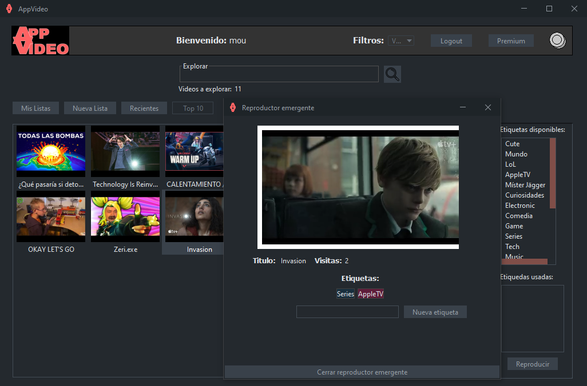

# :clapper: APPVideo

Una aplicacion de escritorio en Java construida con componentes de Swing para visualizar y administrar videos de YouTube. Desarrollada siguiendo patrones de diseño y streams de Java 8.



Una vez registrado y autenticado, el usuario puede explorar los videos mediante el buscador,
el cual permite distintos modos de búsqueda: con palabras clave y/o con etiquetas (p. ej, Musica, Trailer, etc.).
Cuando quiera visualizar un cierto video, el usuario puede clicar el boton de Reproducir,
que reproducirá el video en un reproductor emergente, el cual se puede cerrar cuando se desee.
Además se pueden añadir etiquetas adicionales al video si se desea.

Adicionalmente, el usuario puede crear listas de reproducciones accediendo a la pestaña de Nueva Lista.
Una vez se crea una lista con un cierto nombre, 
se pueden añadir los videos que se deseen mediante el buscador incorporado.
Cuando esté creada esta se puede seguir editando en la misma pestaña y
quedara disponible en Mis Listas,
donde podrán visualizarse los videos de la lista.

Además el historial de videos vistos por el usuario es accesible con el botón de Recientes
y los videos más populares se encuentran en la pestaña Top 10.
Esta ultima solo es accesible para los usuarios Premium, 
condición activable mediante el botón Premium donde también se encuentra la exportación
de las listas en un PDF.


## :arrow_forward: Ejecucion
Si tan solo se desea probar la aplicación se sugieren los siguientes pasos:
1. Ir al apartado Releases del repositorio.
2. Descargar los archivos ```AppVideo.jar```, ```ServicioPersistenciaH2.zip``` y ```videos.xml```.
3. Descomprimir ```ServicioPersistenciaH2.zip``` y ejecutar la base de datos:
    ```
    java -jar ServicioPersistenciaH2/ServicioPersistencia.jar
    ```
4. Ejecutar el JAR de la aplicación:
    ```
    java -jar AppVideo.jar
    ```

## :bricks: Desarrollo
El proyecto esta desarrollado en Maven y Eclipse, por lo que se pueden seguir los siguientes pasos para instalar el proyecto:
1. Clonar el repositorio.
2. Importarlo en Eclipse: Importar > Maven > Proyecto Maven existente > Seleccionar el AppVideo del repositorio clonado.
3. Ejecutar la clase de Lanzadera.

